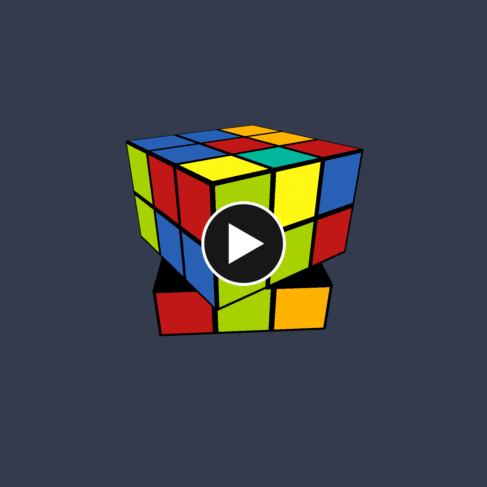
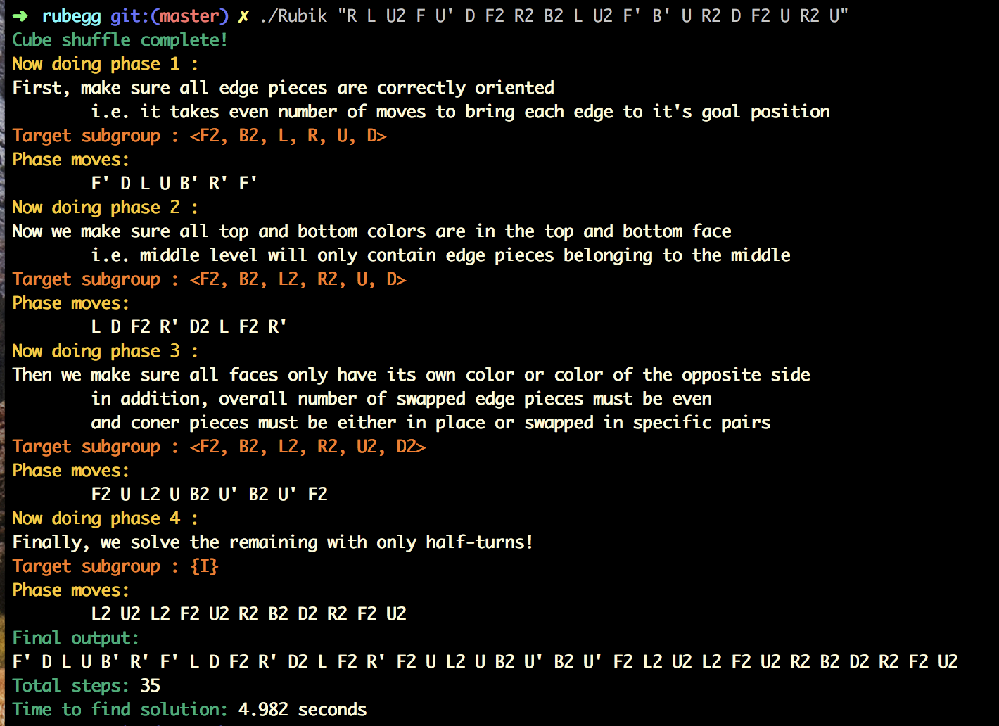
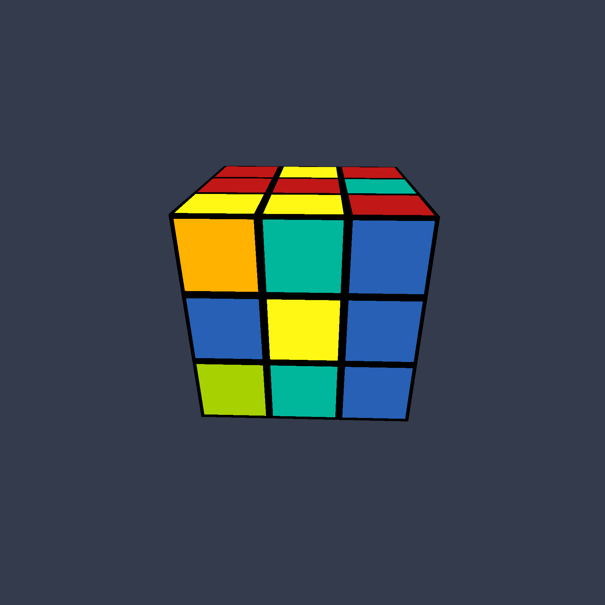
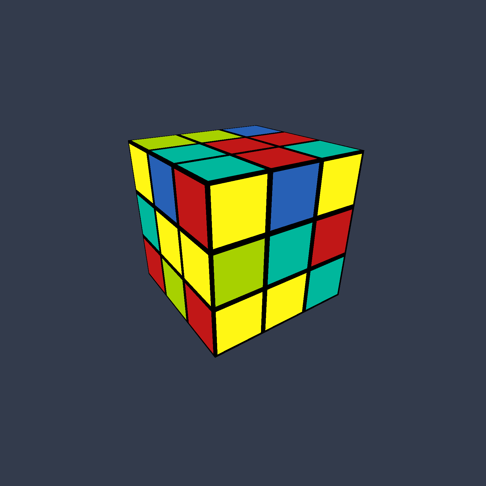
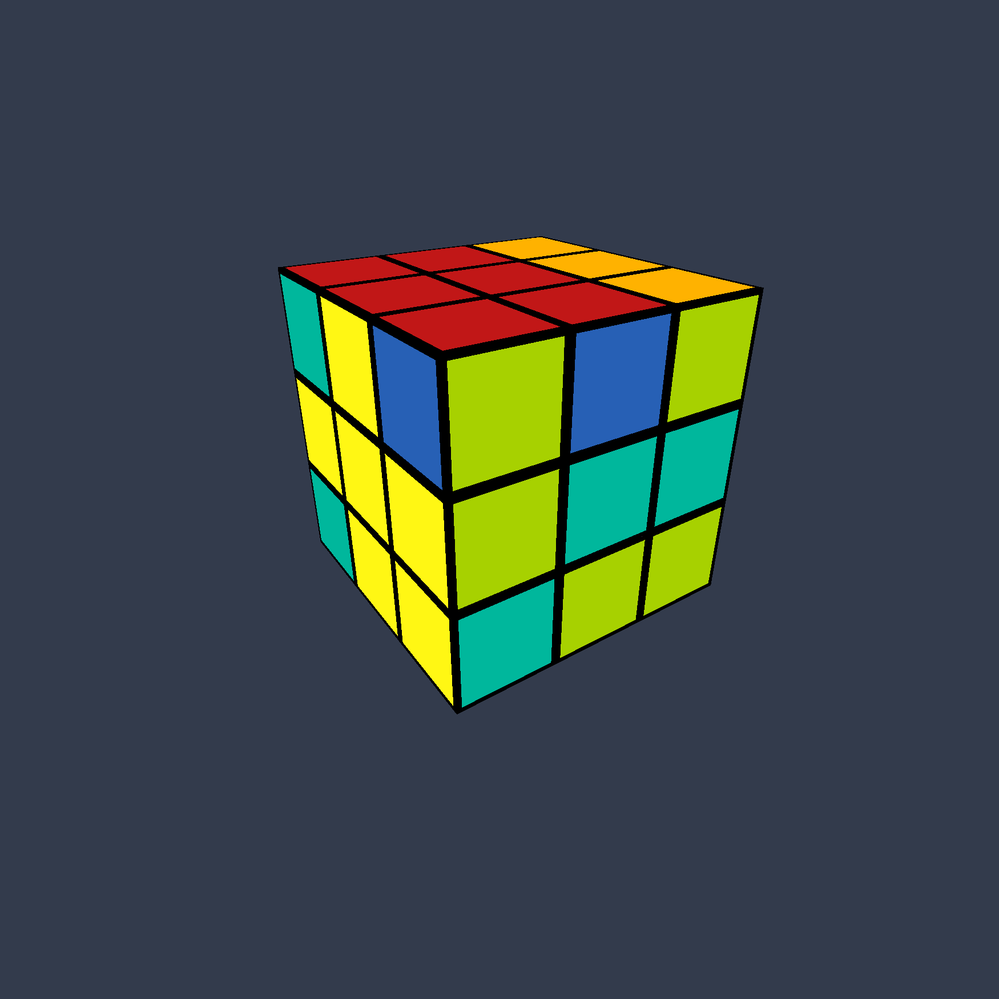
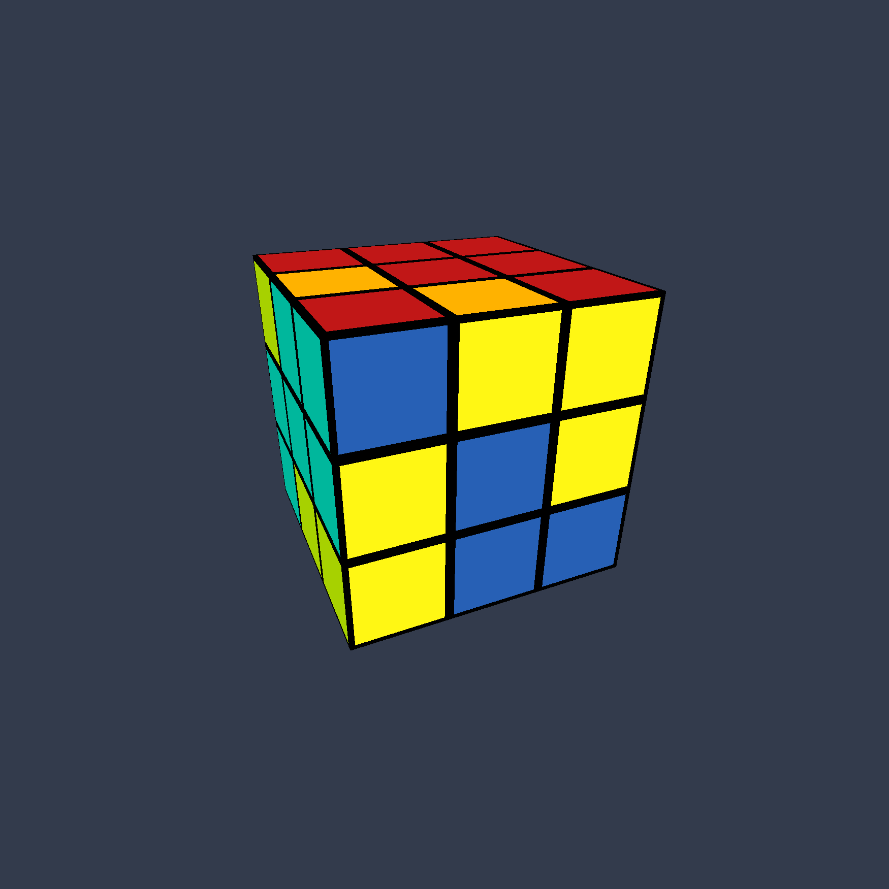
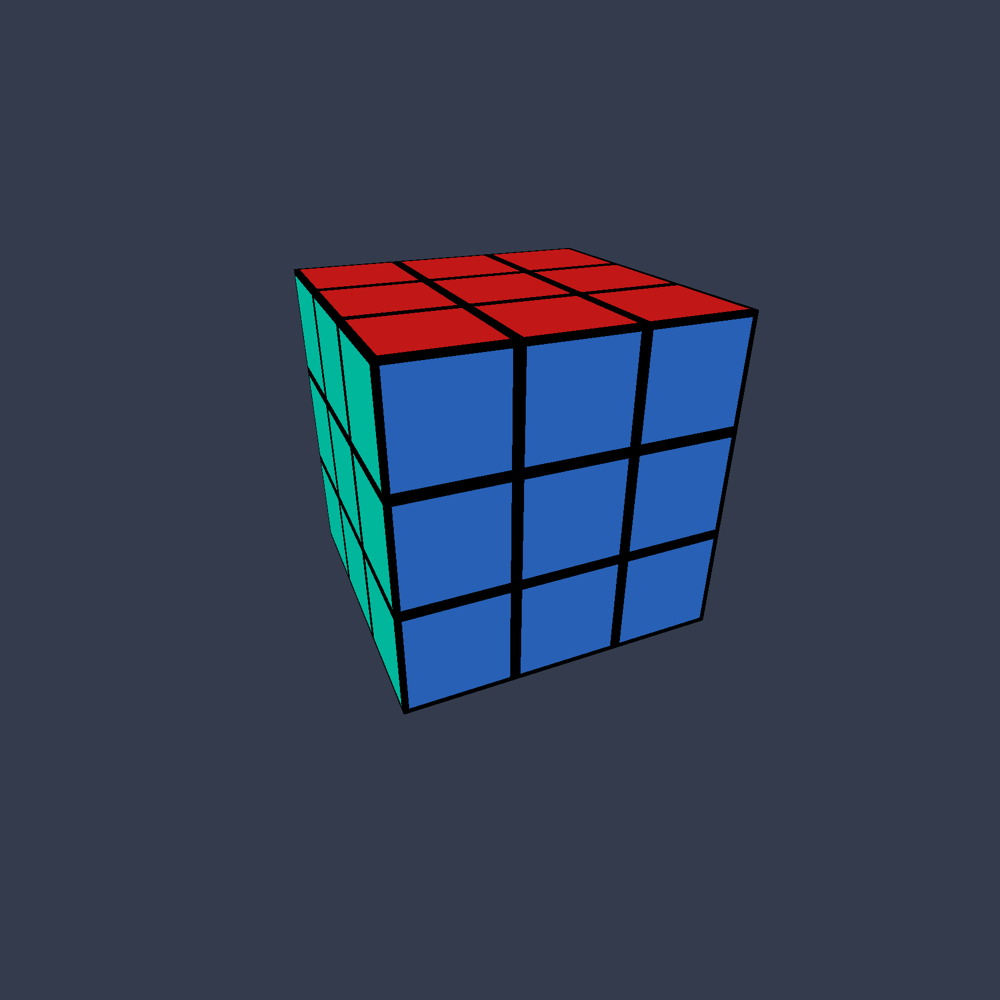

# Rubik's Cube Solver

We implement a verion of Thisletwaite's algorithm along with pattern database technique to give resonably short solution (theoritically up to 52 moves, in reality all our test cases has been < 45 moves) to any Rubik's cube in reasonable time (2-3 seconds). Outputs both a list of moves required to solve the cube and an OpenGl rendition of the shuffled cube being solved.

## Showcase Video
[](https://www.youtube.com/watch?v=KKVDuF6clww "Thistlethwaite Rubik's Solver")

## Screenshot



## How it works

We use a Pattern Database idea much like that in [Korf's paper](https://www.aaai.org/Papers/AAAI/1997/AAAI97-109.pdf) where we hash equivlence classes of the cube states at each of the 4 stages into files and use those files to look-up our cube configurations at the stages. within each stage we use simple BFS to get optimal path into the next stage. The breakdown into subgroups ensures that at each stage the size of the graph and the branching factor is reasonable and BFS does not go for more than 11 steps.

To re-generate the database, go to database folder and `make` then run the excutable.

As in Thisletwaite's, we use 4 phases narrow down the cube group and end at the solved state. After the completion of each phase the ammount of different moves we use to get to the next goes down, letting us cut down on the branching factor which is the exponenital base of the universal cover of the graph we are doing our BFS in. Let's explain them in a sample cube.

The starting cube is shuffled randomly. (i.e. the cube can be anywhere in the group of all permutations of the cube, which is of size 43,252,003,274,489,856,000) and branching factor of every node beging 18.



The first phase ensures the cube to be in the subgroup generated by F2, B2, L, R, U, D, of size ~2.11 * 10 ^ 16 (reduced by a factor of ~2000 from pervious state) and branching factor of 14.



The second phase ensures the cube to be in the subgroup generated by F2, B2, L2, R2, U, D, of size ~1.95 * 10 ^ 10 (reduced by a factor of ~10 ^ 6 from pervious state) and branching factor of 10.



The third phase ensures the cube to be in the subgroup generated by F2, B2, L2, R2, U2, D2, of size ~6.63 * 10 ^ 5 (reduced by a factor of ~20,000 from pervious state) and branching factor of 6.



From there we solve the cube using the 6 avaliable moves



## Comiling and Running

Run `make` to compile. Needed libraries will be downloaded and an executable will be created.

```
Usage: Rubik "shuffle string" [-m | -r]
	Shuffle string: F B U D L R with variations F F' F2
	-m: manually solve the cube with user input
	-r: solve the cube without hashing
```

For more info on shuffle string Cube notation, see [this page](https://ruwix.com/the-rubiks-cube/notation/)

## Runtime Controls

After all the solving conputation is done, the visualizer starts and the solving pauses at the end of each stage, hit `enter` to go to the next stage.

`Space` to pause/resume animation

`WASD` keys to rotate camera

`arrow` keys to move camera

`R, L, U, D, F, B` keys to solve the cube manually in `-m` mode
